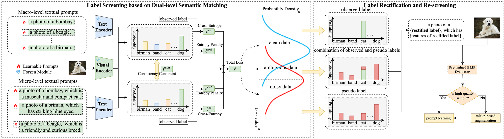

# Screening, Rectifying, and Re-Screening: A Unified Framework for Tuning Vision-Language Models with Noisy Labels [IJCAI 2025]
Official PyTorch implementation for the paper:
> **Screening, Rectifying, and Re-Screening: A Unified Framework for Tuning Vision-Language Models with Noisy Labels**
> Chaowei Fang, Hangfei Ma, [Zhihao Li](https://lzhms.github.io/), De Cheng, Yue Zhang, Guangbin Li
> <a href='https://lzhms.github.io/projects/SRRS/'></a> <a href=''></a> [](https://github.com/LZHMS/SRRS)



## Environment
Set up the conda environment using the provided `environment.yml`:
```bash
# Establish a new conda environment with dependencies
conda env create -f environment.yml

# Activate the new environment
conda activate srrs
```

## Datasets

Please follow [CoOp Datasets Instructions](https://github.com/KaiyangZhou/CoOp/blob/main/DATASETS.md) to install the datasets.

## How to run
### Training
The training operation shares the same script: `scripts/train.sh`.
```sh
CUDA_VISIBLE_DEVICES=0 bash scripts/train.sh dtd 2 symflip False Final
```
<details>
  <summary>Parameters Config</summary>
  
  - `dtd`: dataset name, such as `caltech101`, `food101` and so on.
  - `2`: number of false positive training samples per class.
  - `symflip`: type of noise (symflip, pairflip).
  - `False`: whether to use the GCE loss, `False` or `True`.
  - `Final`: a tag to mark once training pipline.
</details>

After training the prompt learners according to the `scripts/train.sh`, the results will be produced under the directory of `output/Final/`.

### Ablation
We still provide the ablation codes about all submodules in `scripts/ablation/train.sh`.
```sh
CUDA_VISIBLE_DEVICES=0 bash scripts/ablation/train.sh dtd 2 pairflip False ablation CoOpDC
```
<details>
  <summary>Parameters Config</summary>
  
  - `dtd`: dataset name, such as `caltech101`, `food101` and so on.
  - `2`: number of false positive training samples per class.
  - `pairflip`: type of noise (symflip, pairflip).
  - `False`: whether to use the GCE loss, `False` or `True`.
  - `ablation`: a tag to mark once training pipline.
  - `CoOpDC`: the submodule name to do ablation, it will fetch training codes under the directory of `analysis/`.
</details>

The results will be placed under the directory of `output_ablation/CoOpDC`. This makes sure the well organized structure.

### Parsing
The modified codes in `parse_test_res.py` will load training results and parse the `acc` indicators and make a summary.
```sh
CUDA_VISIBLE_DEVICES=0 bash scripts/parse.sh dtd Final
```
<details>
  <summary>Parameters Config</summary>
  
  - `dtd`: dataset name, such as `caltech101`, `food101` and so on.
  - `Final`: a tag to mark once training pipline.
</details>

The script will search the accuracy results in all files under the directory of `output/Final/` and print the calculated average values.

### Analysis
A useful class to analysis the results such as recoding noise variation and visualizing the noise distribution. That's achieved in the file of `analysis.py` and has the same usage with `Parsing`.

## Acknowledgement
We would like to thank the [CoOp](https://github.com/KaiyangZhou/CoOp) and [PTNL](https://github.com/CEWu/PTNL) for open-sourcing their code.

## References
+ [CoOp: Prompt Learning for Vision-Language Models](https://github.com/KaiyangZhou/CoOp)
+ [PTNL: Why Is Prompt Tuning for Vision-Language Models Robust to Noisy Labels?](https://github.com/CEWu/PTNL)
